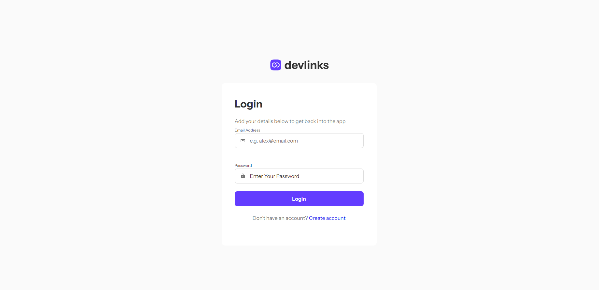
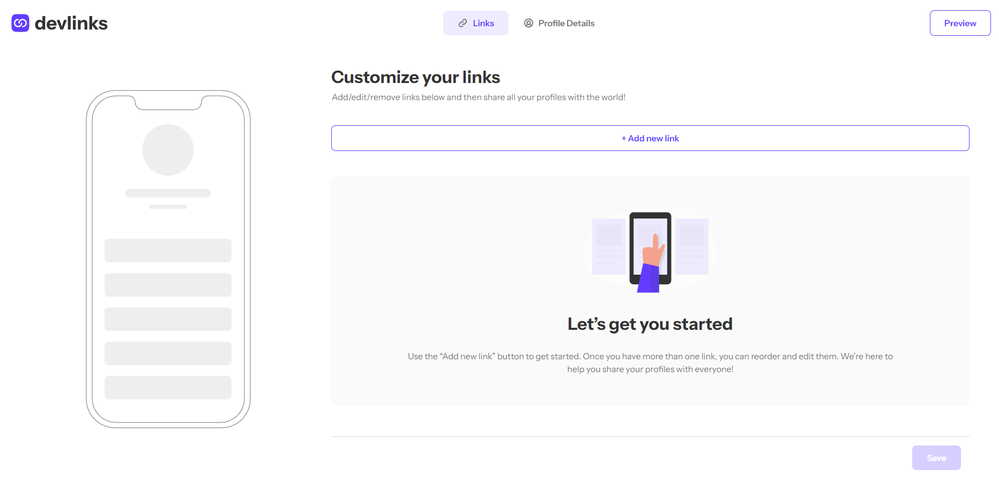
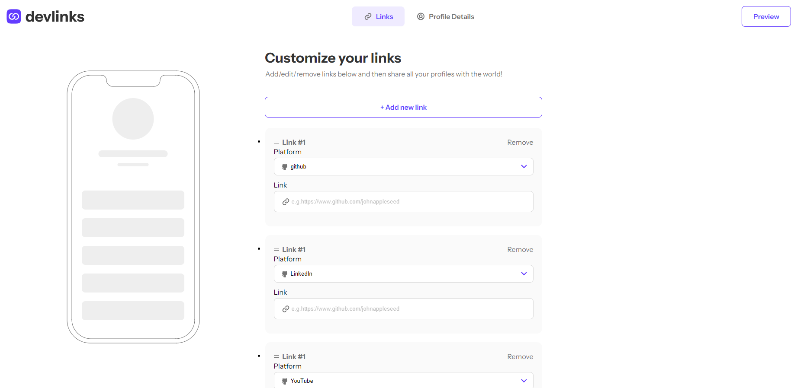
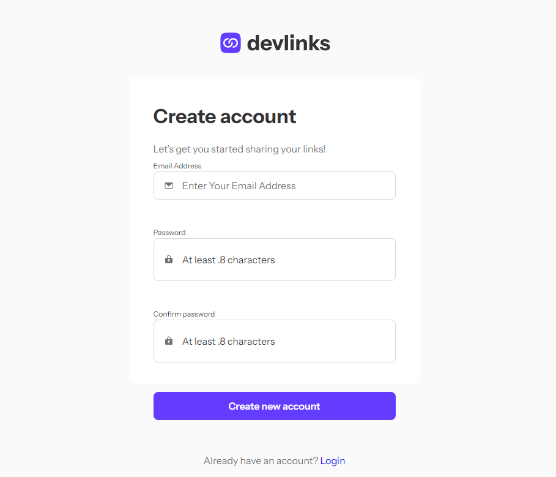

#Link Sharing App

##Links
-Live site URL: [vercel](https://the-best-squad.vercel.app/)

##Overview
Our application's purpose is to make sharing links easier, with it, you can add up to multiple of links to our website, for example: Github, for your projects, Youtube, for your educational videos etc. The links are then attached to your profile, which anyone can view and then click on the links which are below your profile picture.

##Screenshots







##Built with
The technologies we used are quite simple, HTML, CSS and Javascript. These languages are known by every programmer, new or advanced. And the good thing about it is that they are very easy to understand, and quite easy to learn as well.

##Work Process
We all faced bugs and errors during the building of our application, but of course. we learnt from our mistakes and fixed them right away! We had a problem on the design of the login page and registry page, but nothing that we couldn't fix with a few minutes of revision. We hope to add more features to our app, to not only just post links on your profile picture, but to add a posting system, A place where you can share your problems in coding, maybe even a tutorial, maybe you can even put up a job application as well! As our knowledge grows and grows, we hope to implement these features into our app

##Getting started
If you want to test the app for yourself, either to review it or train on it, you need to download it, only then you can use the project! So this is how you do it!
1. Clone the repository:
```
git clone https://github.com/TemuriTsutskiridze/The-best-squad.git
```

2. Go to the project folder:
```
cd .\The-best-squad\
```


##How the webpage works
The project starts off with an login page, you can of course move onto a registration page as well which is shown on the login page, after you have filled in the information for the registration page you will move back to the login page which you need to fill it in once again, (email and password). Then this will move you to the star of the show! Our link sharing app, to create a profile type in your name, surname and that's it. You can optionally as well add a profile picture of your own liking and of course add links to your profile, which people can use to see your work or visit your socials, click Save and your profile will be built.

##Credits
Now, this was not a one man made project. This was done by a team of professional programmers, each doing their part in building the app. 
Giorgi Shengelia: Helped with Login and Registry Page.
Achi Phutkaradze: Helped with designing the main part of the website and adding functions to it as well.
Luka Vadatchkoria: Helped to make the website functionable and fixed any mistakes that might have been gone unnoticed by some other developers.
And the main lead, Temuri Tsutskiridze:Helped with pretty much everything while building the app.

##Profile Links
-Giorgi Shengelia: [GitHub](https://github.com/xvlika)
-Achi Phutkaradze: [GitHub](https://github.com/AchiPhutkaradze)
-Luka Vadatchkoria: [GitHub](https://github.com/lukavadatchkoria)
-Temuri Tsutskiridze [GitHub](https://github.com/TemuriTsutskiridze)